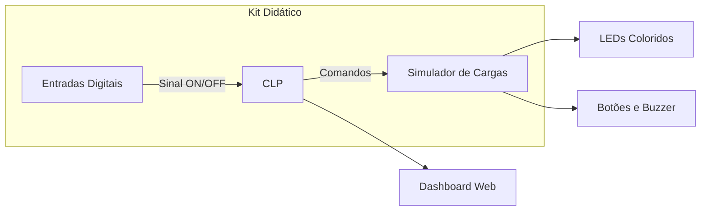
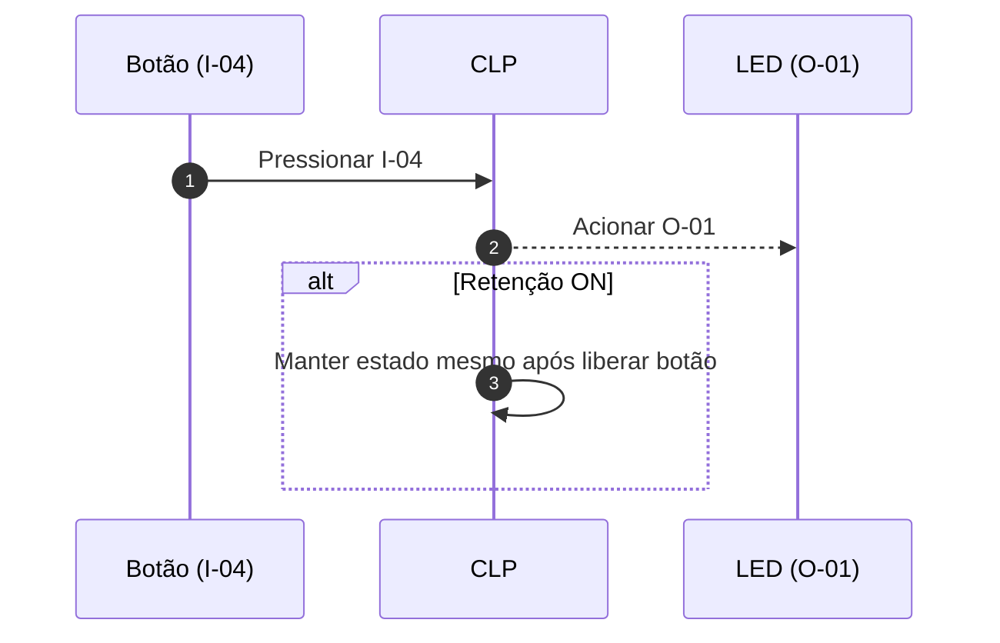
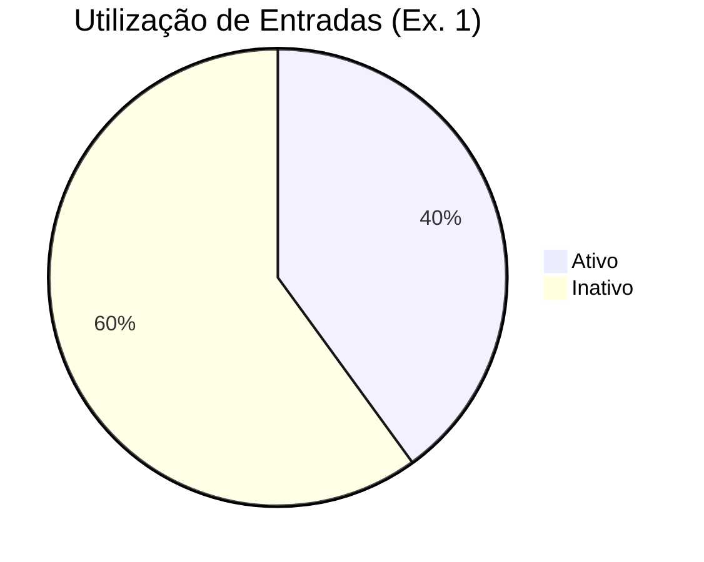

# 💡 Kit Didático CLP – SENAI-DF

Este repositório contém todo o material didático, exemplos de código e orientações para utilização dos **Kits Didáticos SENAI-DF**, focados no ensino de **Controladores Lógicos Programáveis (CLP)**.

---

## 📋 Sumário

* [Descrição Geral](#descrição-geral)
* [Objetivos de Aprendizagem](#objetivos-de-aprendizagem)
* [Componentes e Tecnologias](#componentes-e-tecnologias)
* [Arquitetura do Sistema](#arquitetura-do-sistema)
* [Diagrama de Fluxo de Sinais](#diagrama-de-fluxo-de-sinais)
* [Instalação e Configuração](#instalação-e-configuração)
* [Exercícios e Estudos de Caso](#exercícios-e-estudos-de-caso)
* [📈 Dashboard em Tempo Real](#dashboard-em-tempo-real)
* [Monitoramento e Análise de Dados](#monitoramento-e-análise-de-dados)
* [Contribuições](#contribuições)
* [Licença](#licença)

---

## 📝 Descrição Geral

O **Kit Didático CLP – SENAI-DF** oferece um ambiente prático para aprendizagem de automação industrial. Ele integra:

* **Controlador Lógico Programável**: módulo Allen-Bradley com comunicação D+/D-.
* **Painel de Entradas**: 12 entradas digitais configuráveis (`I-00` a `I-11`).
* **Painel de Saídas e Simulador de Cargas**: LEDs coloridos, lâmpadas, botões e cilindros pneumáticos simulados.
* **Fonte de 24 VDC** e bornes GND.
* **Manual de Operação** completo, diagramas elétricos e pneumáticos.

### 📚 Objetivos de Aprendizagem

1. Programar lógicas em **Ladder Diagram (LD)**.
2. Configurar mapeamento de endereços I/O.
3. Testar algoritmos de retenção, sequenciamento e intertravamentos.
4. Ler e interpretar diagramas elétricos e pneumáticos.
5. Criar um **Dashboard** para monitorar estados em tempo real.

---

## ⚙️ Componentes e Tecnologias

| Categoria           | Descrição                                 |
| ------------------- | ----------------------------------------- |
| **Hardware**        | CLP Allen-Bradley, fonte 24 VDC, bornes   |
| **Painel Didático** | Chaves ON/OFF, botões com retenção, LEDs  |
| **Software PLC**    | RSLogix 5000, TIA Portal, ou equivalente  |
| **Dashboard Web**   | Node-RED, Grafana ou aplicação web básica |
| **Diagramas**       | Mermaid, PDF do manual de operação        |

---

## 🏗️ Arquitetura do Sistema



*Visão geral dos componentes e fluxo de sinal.*

---

## 📊 Diagrama de Fluxo de Sinais



*Sequência de acionamento com lógica de retenção.*

---

## 🔧 Instalação e Configuração

1. **Conexões Físicas**

   * `24+` ➔ Fonte +24 VDC
   * `GND` ➔ Fonte GND
   * D+, D- ➔ Porta USB/RS-485 do PC

2. **Software**

   ```bash
   git clone https://github.com/usuario/projeto-clp-senai.git
   cd projeto-clp-senai
   # Abra o projeto .ewp ou .ap15 no seu IDE PLC
   ```

3. **Mapeamento de Endereços**

| Painel | Endereço PLC |
| ------ | ------------ |
| I-00   | I:0/0        |
| I-01   | I:0/1        |
| ...    | ...          |
| O-00   | O:0/0        |
| O-01   | O:0/1        |

4. **Upload do Programa**

   * No IDE PLC, selecione o controlador e transfira o programa.
   * Observe LEDs de status no módulo.

---

## 🏋️ Exercícios e Estudos de Caso

| Ex. | Objetivo             | Descrição                                  |
| --- | -------------------- | ------------------------------------------ |
| 1   | Acionamento Simples  | Botão I-04 acende LED O-01                 |
| 2   | Sequência Lumínica   | Sequenciar O-01 → O-02 → O-03 a cada 500ms |
| 3   | Retenção com Chave   | Botão + Chave de retenção mantém LED       |
| 4   | Simulação Pneumática | Acionar cilindro A após cronômetro interno |

---

## 📈 Dashboard em Tempo Real

Para deixar o aprendizado mais dinâmico, implementamos um **dashboard web** que mostra graficamente a evolução dos sinais:



*Exemplo de gráfico de pizza em Mermaid.*

🖥️ **Sugestão de implementação**:

```js
// Node-RED flow snippet
[{
  "id": "plc_input",
  "type": "modbus-read",
  "topic": "I:0/0",
  "rate": 500,
  "outputs": 1
}, {
  "id": "chart",
  "type": "ui_chart",
  "chartType": "line",
  "legend": true,
  "xformat": "HH:mm:ss"
}]
```

---

## 📑 Monitoramento e Análise de Dados

* **Grafana**: conecte-se ao InfluxDB que recebe dados do CLP via Telegraf.
* **Relatórios**: gere gráficos de performance e tempo de resposta.

---

## 🤝 Contribuições

Contribua com novos exercícios, diagramas ou integrações de dashboard!

1. Fork este repositório
2. Crie uma branch: `feature/nova-exercício`
3. Commit suas alterações
4. Abra um Pull Request

---

## 📄 Licença

Uso educacional restrito ao SENAI-DF. Para uso externo, solicite autorização.

